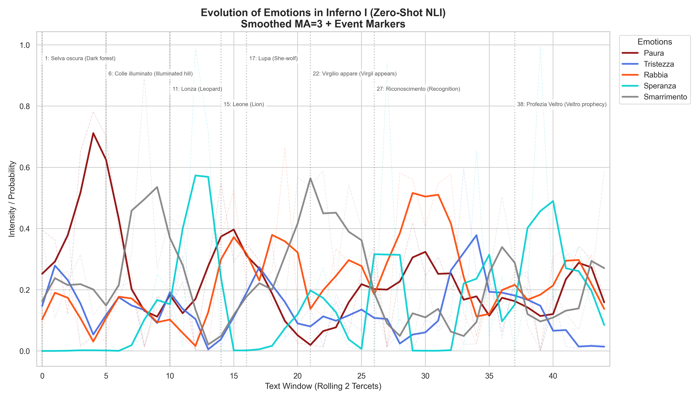
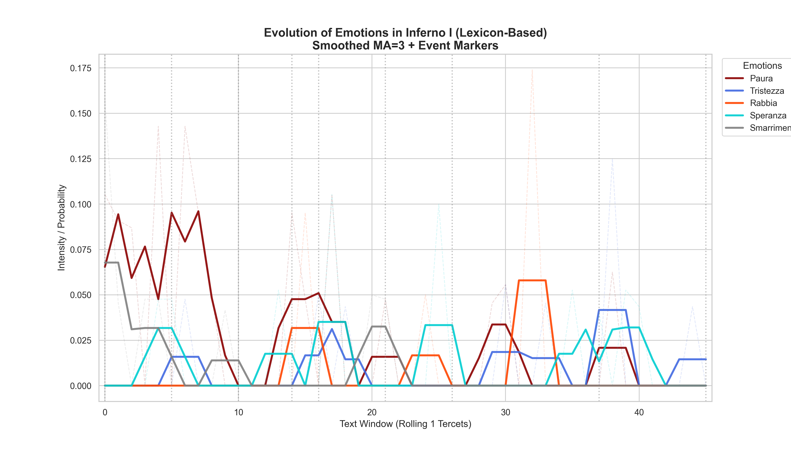

# Dante Emotion Analysis: Zero-Shot NLI
## Computational Analysis of Inferno Canto I

[](https://www.python.org/downloads/)
[](https://opensource.org/licenses/MIT)
[](#)

---

## 📖 Overview

This project applies **Zero-Shot Natural Language Inference (NLI)** to analyze the emotional evolution of Dante Alighieri's *Inferno* (Canto I). 

Unlike traditional classification (which relies on fixed keywords or Twitter-based training like FEEL-IT), we use a **Hypothesis Testing** approach with `mDeBERTa-v3` to bridge the linguistic gap between medieval (14th century) and modern Italian.

### Key Features
- **Zero-Shot NLI**: Logical entailment captures semantic and implicit emotions without fine-tuning on Dante.
- **Sliding Window Analysis**: 2-tercet blocks provide narrative context for metaphor understanding.
- **Dual Methodology**: Compares AI inference against a baseline Lexicon approach.
- **Scientific Validation**: Results validated against literary ground truth (Dark Forest → Fear/Bewilderment, Hill → Hope).

---

## 🎯 Results

The NLI model successfully identifies:
- **Bewilderment** (*Smarrimento*) in the opening "Dark Forest" scene
- **Hope** (*Speranza*) at the illuminated Hill via objective correlative (Light = Divine Hope)
- **Anger** (*Rabbia*) in the Three Beasts encounters (Tercets 16-21)

Where traditional Twitter-based models (FEEL-IT) incorrectly label the opening as mere "Sadness", our approach correctly infers the existential concept of "being lost".

---

## 🚀 Quick Start

```bash
# 1. Clone the repository
git clone https://github.com/yourusername/dante-emotion-analysis.git
cd dante-emotion-analysis

# 2. Create and activate virtual environment
python -m venv venv
.\venv\Scripts\activate  # Windows
source venv/bin/activate  # Linux/Mac

# 3. Install dependencies
pip install -r requirements.txt

# 4. Run Analysis
python main.py
```

The script will automatically:
- Load the mDeBERTa model (first run requires internet)
- Analyze all 46 tercets of Canto I
- Run both NLI and Lexicon analysis for comparison
- Validate results against literary ground truth
- Save plots and data to `output/`

---

## 🏗️ Project Structure

```
dante_emotion_analysis/
├── main.py                 # ENTRY POINT: Full Analysis Pipeline
├── config.py               # Centralized settings (paths, emotions, colors)
├── requirements.txt        # Python dependencies
├── LICENSE                 # MIT License
├── PAPER_SECTION.md        # Methodological documentation
│
├── data/
│   ├── canto_i_inferno.txt         # Canto I full text (Petrocchi edition)
│   └── emotion_lexicons/
│       └── italian_emotions.json   # Custom Dante-specific lexicon
│
├── src/
│   ├── emotion/            # Core analysis modules
│   │   ├── transformer_based.py    # ZeroShotAnalyzer (mDeBERTa NLI)
│   │   └── lexicon_based.py        # LexiconEmotionAnalyzer
│   └── preprocessing/      # Text tokenization (TerzinaTokenizer)
│
├── docs/                   # Presentation materials
│   ├── DEFENSE_SCRIPT.md
│   ├── CASE_STUDIES_PRESENTATION.md
│   └── TEORIA_E_LOGICA_PROGETTO.md
│
└── output/                 # Generated Results (gitignored)
    ├── zeroshot_curve.png
    ├── zeroshot_heatmap.png
    ├── lexicon_curve.png
    └── zeroshot_results.json
```

---

## 🔬 Why Zero-Shot NLI?

We discarded standard classification models (like **FEEL-IT**, trained on Twitter) because they consistently misclassified Dante's *Inferno*:

| Scene | FEEL-IT (Twitter) | Our NLI Model | Ground Truth |
|-------|-------------------|---------------|--------------|
| Dark Forest | Sadness ❌ | Bewilderment ✅ | Bewilderment |
| Illuminated Hill | Neutral ❌ | Hope ✅ | Hope |
| The Lion | Fear | Fear + Anger ✅ | Fear + Anger |

**Zero-Shot NLI** leverages logical entailment: instead of pattern matching, the model asks *"Does this text logically entail 'Hope'?"* — enabling inference over metaphorical and archaic language.

---

## 📊 Sample Output

After running `python main.py`, the `output/` folder will contain:

### Emotion Evolution (Zero-Shot NLI)


### Intensity Heatmap ("Semantic Barcode")


### Lexicon Baseline (for comparison)


Raw data is saved in `output/zeroshot_results.json` with scores for each emotion per sliding window.

---

## 📚 Documentation

Additional materials are available in the `docs/` folder:
- `PAPER_SECTION.md` - Full methodology and scientific rationale
- `DEFENSE_SCRIPT.md` - Oral exam talking points
- `TEORIA_E_LOGICA_PROGETTO.md` - Theoretical foundations (Italian)

---

## 🛠️ Technologies

- **Model**: [mDeBERTa-v3-base-mnli-xnli](https://huggingface.co/MoritzLaurer/mDeBERTa-v3-base-mnli-xnli)
- **Framework**: HuggingFace Transformers
- **Visualization**: Matplotlib, Seaborn
- **Text Processing**: Custom TerzinaTokenizer for tercet-based analysis

---

## 👥 Authors

**Giuseppe Spicchiarello** - Technical Lead & AI Implementation

Project developed for the **Digital Italian Literature** course  
Master's Degree in Language Technologies and Digital Humanities  
University of Pisa / University of Siena / University of Florence

---

## 📄 License

This project is licensed under the MIT License - see the [LICENSE](LICENSE) file for details.

---

Made with ❤️ for AI Research by Giuseppe Spicchiarello.
